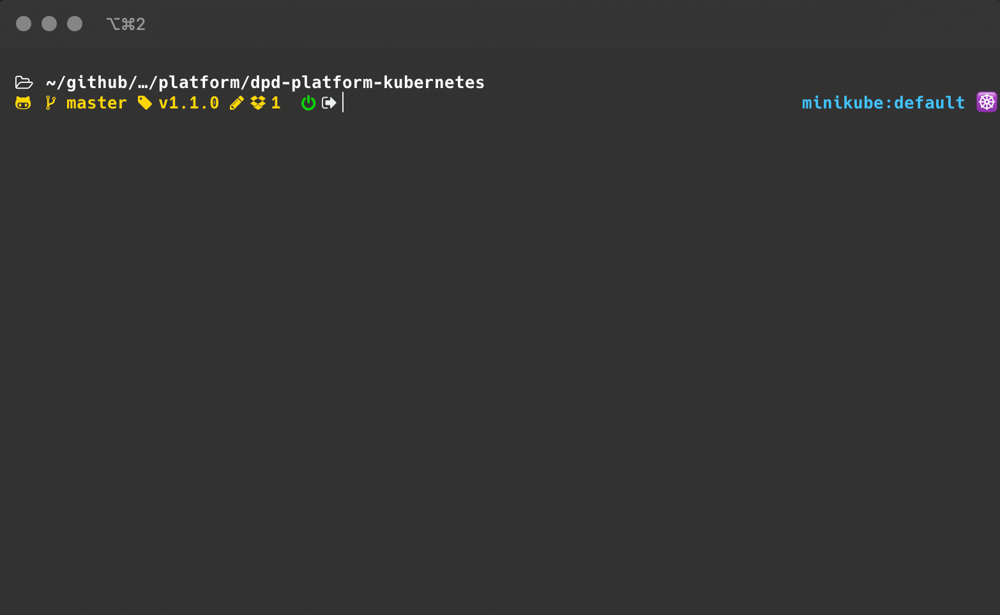

### 2. Local tools and setup

#### local kubernetes related packages used in this setup (recommend homebrew to manage)  

[kubectl](https://kubernetes.io/docs/tasks/tools/install-kubectl/) • kubernetes api command-line tool  
[helm](https://helm.sh) • manage pod deploys  
[kubefwd](https://github.com/txn2/kubefwd) • develop locally with remotes services available as they would be in the remote cluster  
[kubectx](https://github.com/ahmetb/kubectx) • cli to quickly swtich between local or remote clusters  
[skaffold](https://github.com/GoogleContainerTools/skaffold) • continuous development on local kubernetes  
[stern](https://github.com/wercker/stern)  • tails logs to the terminal from any number of local or remote pods  
[mkcert](https://github.com/FiloSottile/mkcert) • Automated management of certificates and CA for local https    

_local cli interaction with remote platform services_  

[Vault](https://www.vaultproject.io)  
[Consul](https://www.hashicorp.com/products/consul)  
[buildkite cli](https://github.com/buildkite/cli)  

_code complete_  
[hadolint](https://github.com/hadolint/hadolint) • Dockerfile lint/inspection   
[kubeval](https://github.com/garethr/kubeval) • k8 yaml lint/inspection  
[git-secrets](https://github.com/awslabs/git-secrets)  

_local terminal customization_  
[kube-ps1](https://github.com/jonmosco/kube-ps1)  
[oh-my-zsh](https://ohmyz.sh)  

